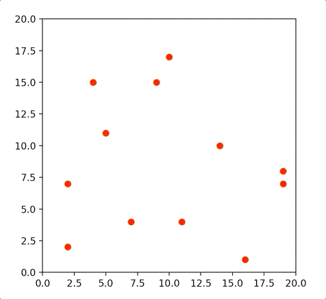
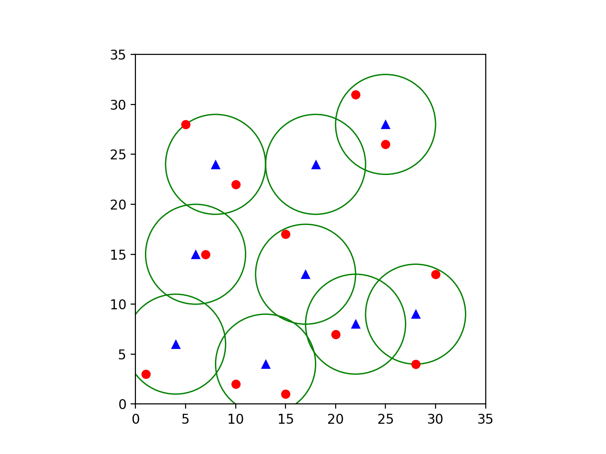
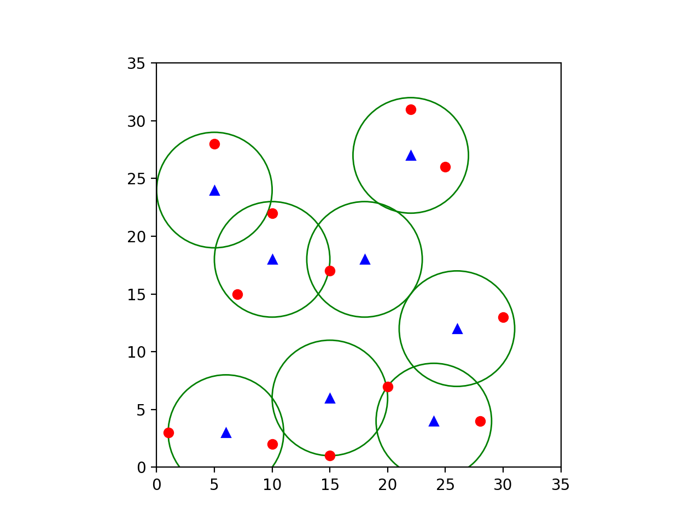
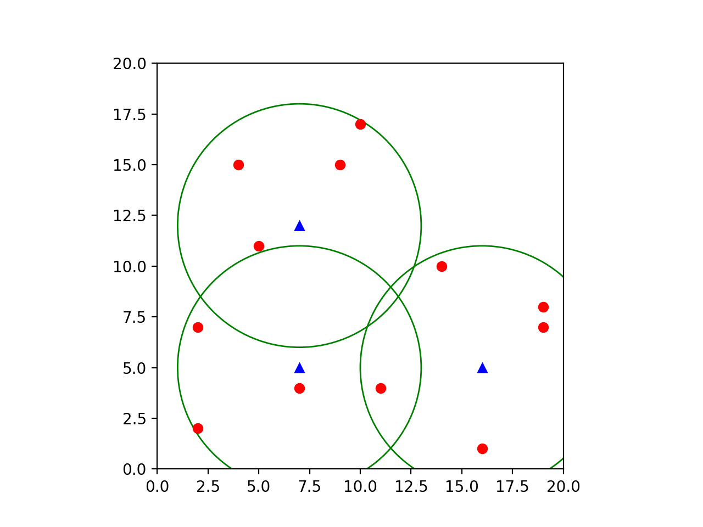

# WiFiCoverageCSP
Course Project of Artificial Intelligence for a new Constraints Satisfaction Problem

<p align="center">
	 <br>
	Red: Device | Blue: WiFi | Green: WiFi-Range<br>
	Execution For: D=12 | K=4 | R=5 | HxW=20x20<br>
</p>

# Index
1. [Problem](#problem)
	1. [Necessity](#necessity-the-mother-of-invention)
	2. [Problem Statement](#problem-statement)
	3. [Mathematical Problem Statement](#mathematical-problem-statement)
	4. [Novelty](#novelty)
2. [Why Compute?](#why-compute)
3. [Approach](#approach)
4. [Technical Challenges](#technical-challenges)
5. [Analysis](#analysis)
6. [Results](#results)
	1. [Small Grid](#small-grid)
	2. [Medium Grid](#medium-grid)
	3. [Large Grid](#large-grid)
7. [Conclusions](#conclusions)
8. [Project Setup](#project-setup)

# Problem
1. ## Necessity: The Mother of Invention
	- I was required to do a course project in artificial intelligence.
	- It's purely hypothetical situation.
	- In the Lockdown, I wanted to buy a broadband internet connection & have a wireless router to span the access range across the whole house.
	- Since I have a bigger house space & my house had concealed and jammed wiring (without LAN cables); instead of having a single long-ranged (costly) wireless router whose range fades across the boundary, I thought of having multiple wireless routers in wireless bridge mode with each other & belonging to the same wireless network space. Also, a goal was to minimise the cost.
	- Instead of multiple wireless routers, I can also use A main router with multiple range extenders belonging to the same wireless network. (Analogy is the same)
	- Then I thought that covering the whole house is pointless, instead only the portions in which wifi is required should be covered.

2. ## Problem Statement
	- Given a space and some places which are required to be covered, can I come up with an arrangement of wireless routers such that they are connected to the same wireless network & the arrangement is minimal(less costly) ?

3. ## Mathematical Problem Statement
	- For a simple scenario let's assume,
		- Space: a H*W Grid
		- Device-Coordinates: Devices, |Devices| = D
		- Wireless Router Range: R
		- No of Routers: K
	- I need to come up with an arrangement of K routers such that,
		- They belong to the same wireless network space
		- Each device should be at some distance=d(≤R) from some router/repeater.
4. ## Novelty
	- I was not able to find
		- any problem exactly similar to this problem
		- any solution to this problem
	- So, this is something new. (According to my knowledge base)
	- Why should we compute this is shown below(↓) in detail.

# Why Compute?
- Why compute, when a human can manually do this with some toys?
	- Just When You think that you have found a minimum!
	- Let's take an example of a problem, with 2 solutions below, 'K' Representing the number of routers & 'R' Representing the wireless range of each router.
	- Solution1 is easy to come up with, but Solution2 is not easy to find, which may require a good amount of computation.
	- That's why compute.
	- Red: Device | Blue: WiFi | Green: WiFi-Range
		<p align="center">
			<br>
			Problem: HxW=35x35 | D=12<br><br>
			<br>
			Solution1: K=9 | R=5<br>
			<br>
			Solution2: K=8 | R=5<br>
		</p>

# Approach
- The approach was to describe this problem as constraints satisfaction problem(CSP).
- The problem can be formulate as a CSP by,
	- Defining the state to be the set of coordinates of the positions of the routers.
	- Defining the constraints,
		- The Graph G(V, E) should be connected
			- V: Coordinate of the router position in the Space
			- E: (a, b) exists if EuclideanDist(a, b) ≤ 2*R (Ranges must Overlap)
		- Each Device should be at a EuclideanDist=d from some router, such that d≤R.
- Due to high degrees of H, W, K - Recursion & Backtracking is not a good option.
- So, This problem must be solved by transforming it into an optimisation problem & by applying optimisation algorithms.

# Technical Challenges
- The Optimisation algorithms used are,
	- Hill Climbing (Max-Variant)
		- With Random Restart
	- Escaping Shoulders (Max-Variant)
		- With Random Restarts
- After defining the state, the main tasks were,
	- To come up with a state evaluation function
	- To Come up with a state.max_valued_neighbour() function for different arrangements of the wifis resulting from some transformation on the current state.

- I implemented these(↑) functions with the ideas below(↓),
1. ## state.evaluate()
	- Approach1
		- Define a variable **val**
		- Add the number of devices for which EuclideanDist from some WiFi is d(≤R), to **val**, goal is **val=D**.
		- Run BFS on the graph G(V, E) until all the nodes are visited exactly once(like in a tree). The BFS is for obtaining all the disconnected components one by one from the graph in the form of a tree, & add the len(found_component)-1 to **val** for each component. 
		- Here idea is to search each disconnected component of the graph to form a tree & since it's a **m** node tree, the number of edges in it must be **m-1**, so this way our goal is to connect the whole graph, or in other words, BFS returns only one disconnected component with, **m-1 = |V|-1**.
		- Return **val** from this function.
		- Final Goal: **val=|Devices|+|V|-1**

	- Approach2
		- Define a variable **val**
		- For Each device
			- If EuclideanDist of device from some WiFi is d≤R: Then do nothing.
			- Else: Add **d-R** to **val**; **d**: EuclideanDist from a WiFi which is closest to the device.
		- This way we want **val** to be 0 for devices.
		- Define another variable **previousComponent=None**
		- Now Use the same BFS in the previous approach, except this time, for each disconnected component returned by BFS defined as **currentlyFoundComponent**,
			- If previousComponent==None: Then do nothing
			- Else:
				- add EuclideanDist of approximate centroids of **previousComponent** & **currentlyFoundComponent**
				- **previousComponent=currentlyFoundComponent**
		- This way for connectivity, we want to have only one and only disconnected-component or may I say, connected-Graph.
		- return **-val** (Algorithm is of Maximiser variant)
		- Final Goal: **val=0**
		- This approact is better than the previous, because in this approach while going through the successors, unlike previous approach **val** precisely defines, how much are you closer to the goal. 
2. ## state.get_max_valued_neighbour()
	- For this function I defined some allowed actuations on each WiFi coordinate=**direction_vectors**,
	- The idea is to try out all the possible combinations on each wifi-coordinate & return the maximum valued one. **|combinations| = |direction_vectors|^K**
	- This approach is computationally very expensive.
	- It's not the best approach, there may exist a better one, but it was 100% sure to work.

# Analysis
- Since randomness is involved, the exact Time complexity cannot be found.
- Due to optimisation algorithms, a particular state is under observation at a time, So the Space complexity is not that high, It will be **O(K)**.
- As you can see the performance bottleneck is the function **state.get_max_valued_neighbour()**, which is exponential in nature. **|combinations| = |direction_vectors|^K**, which may be the major factor in time complexity of the algorithm.
- **Appying Genetic algorithms** may or may not be a better than this approach, because it wouldn't have to go through all the neighbours of the current state & randomisation is a lot in that algorithm, respectively.

# Results
- In Graphs-> Red: Device | Blue: WiFi | Green: WiFi-Range
1. ## Small Grid
	- Problem Visualisation:
		- Devices={(2, 2), (2, 7), (9, 7), (9, 5), (9, 2)}
		- HxW=10x10
		<p align="center">
			
		</p>
	- Solution Visualisation:
		- WiFiCoords={(2, 5), (4, 2), (7, 2), (9, 5)}
		<p align="center">
			<br>
			K=8 | R=8
		</p>

2. ## Medium Grid
	- Problem Visualisation 
		- Devices={(2, 2), (2, 7), (9, 15), (14, 10), (19, 8), (19, 7), (10, 17), (5, 11), (11, 4), (4, 15), (16, 1), (7, 4)}
		- HxW=20x20
		<p align="center">
			<br>
		</p>
	- Solution1 Visualisation:
		- WiFiCoords={(4, 4), (4, 12), (11, 15), (15, 4), (17, 10)}
		<p align="center">
			<br>
			K=5 | R=4
		</p>
	- Solution2 Visualisation:
		- WiFiCoords={(3, 3), (8, 5), (6, 14), (16, 6)}
		<p align="center">
			<br>
			K=4 | R=5
		</p>
	- Solution3 Visualisation:
		- WiFiCoords={(7, 5), (7, 12), (16, 5)}
		<p align="center">
			<br>
			K=3 | R=6
		</p>

3. ## Large Grid
	- Problem Visualisation
		- Devices={(1, 3), (10, 2), (15, 1), (20, 7), (7, 15), (15, 17), (25, 26), (10, 22), (30, 13), (22, 31), (28, 4), (5, 28)}
		- HxW=35x35
		<p align="center">
			<br>
		</p>
	- Solution1 Visualisation:
		- WiFiCoords={(6, 3), (5, 24), (10, 3), (15, 6), (18, 18), (22, 27), (24, 4), (26, 12)}
		<p align="center">
			<br>
			K=8 | R=5
		</p>
	- Solution2 Visualisation:
		- WiFiCoords={(9, 3), (24, 8), (10, 22), (24, 24)}
		<p align="center">
			<br>
			K=4 | R=8
		</p>

# Conclusions
- 5$ worth of computation is better than buying a 50$ worth of extra machine.
- Let's define this Problem-Solver W.
- For a given Problem (HxW, K, R, Devices), given 3 scenarios are possible due to the randomness of the algorithm.
	- There exists a solution & W finds it in time T.
	- There exists a solution & W doesn't find it in time T.
	- There doesn't exist a solution & W doesn't find it in time T.

# Project Setup
- **Clone**
	```sh
	$ git clone https://github.com/Wolverin-e/WiFiCoverageCSP.git
	```

- **Install**
	```sh
	# Install pipenv if you don't have it
	$ pip install pipenv
	
	# Change the Directory
	$ cd ./WiFiCoverageCSP

	# Install dependencies from Pipfile
	$ pipenv install
	```

- **Activate Environment**
	```sh
	$ pipenv shell
	```

- **Run**
	- Read [executor.py](https://github.com/Wolverin-e/WiFiCoverageCSP/blob/master/executor.py) for more info.
	```sh
	# Check executor.py For By Default Runner
	$ python3 executor.py
	```
