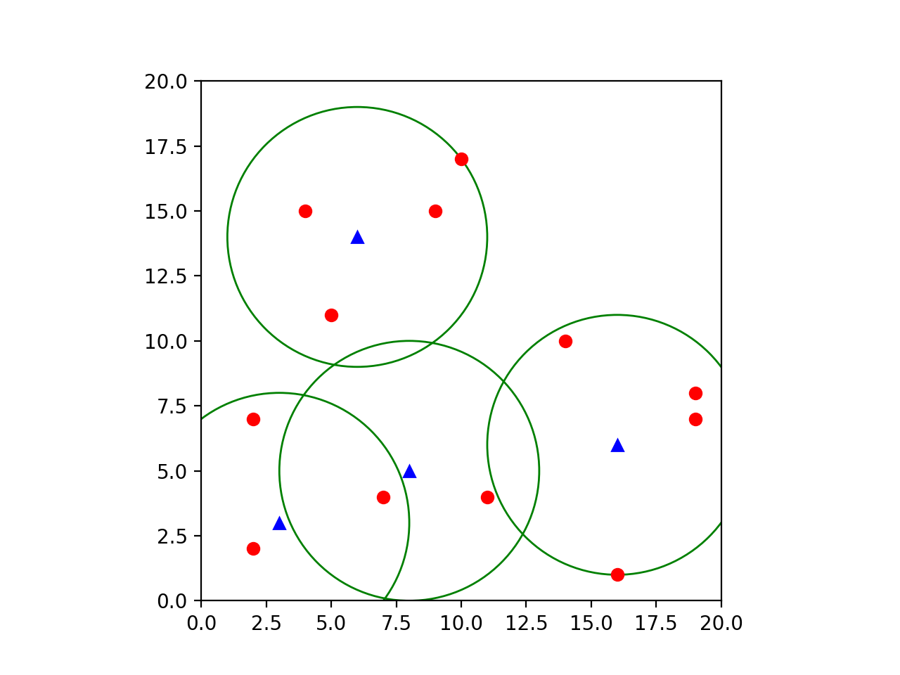

# WiFiCoverageCSP
Course Project of Artificial Intelligence for a new Constraints Satisfaction Problem

<p align="center">
	 <br>
	D=12 | K=8 | R=8 | HxW=35x35
</p>

# Index
1. [Problem](#problem)
	1. [Necessity](#necessity-the-mother-of-invention)
	2. [Problem Statement](#problem-statement)
	3. [Mathematical Problem Statement](#mathematical-problem-statement)
2. [Approach](#approach)
3. [Results](#results)
	1. [Small Grid](#small-grid)
	2. [Medium Grid](#medium-grid)
	3. [Large Grid](#large-grid)
4. [Technical Hurdles](#technical-hurdles)
5. [Getting Started](#getting-started)

# Problem
1. ## Necessity: The Mother of Invention
	- I was required to do a course project in artificial intelligence.
	- It's purely hypothetical situation.
	- In the Lockdown, I wanted to buy a broadband internet connection & have a wireless router to span the access range across the whole house.
	- Since I have a bigger house space & my house had concealed and jammed wiring (without LAN cables); instead of having a single long-ranged (costly) wireless router whose range fades across the boundary, I thought of having multiple wireless routers in wireless bridge mode with each other & belonging to the same wireless network space. Also, a goal was to minimise the cost.
	- Instead of multiple wireless routers, I can also use A main router with multiple range extenders belonging to the same wireless network. (Analogy is the same)
	- Then I thought that covering the whole house is pointless, instead only the portions in which wifi is required should be covered.

2. ## Problem Statement
	- Given a space and some places which are required to be covered, can I come up with an arrangement of wireless routers such that they are connected to the same wireless network & the arrangement is minimal(less costly) ?

3. ## Mathematical Problem Statement
	- For a simple scenario let's assume,
		- Space: a H*W Grid
		- Device-Coordinates: Devices, |Devices| = D
		- Wireless Router Range: R
		- No of Routers: K
	- I need to come up with an arrangement of K routers such that,
		- They belong to the same wireless network space
		- Each device should be at some distance=d(≤R) from some router/repeater.

# Approach
- The approach was to describe this problem as constraints satisfaction problem(CSP).
- The problem can be formulate as a CSP by,
	- Defining the state to be the set of coordinates of the positions of the routers.
	- Defining the constraints,
		- The Graph G(V, E) should be connected
			- V: Coordinate of the router position in the Space
			- E: (a, b) exists if EuclideanDist(a, b) ≤ 2*R (Ranges must Overlap)
		- Each Device should be at a EuclideanDist=d from some router, such that d≤R.
- Due to high degrees of H, W, K - Recursion & Backtracking is not a good option.
- So, This problem must be solved by transforming it into an optimisation problem & by applying optimisation algorithms.

# Results

1. ## Small Grid
	- Problem Visualisation:
		- Devices={(2, 2), (2, 7), (9, 7), (9, 5), (9, 2)}
		- HxW=10x10
		<p align="center">
			
		</p>
	- Solution Visualisation:
		<p align="center">
			<br>
			K=8 | R=8
		</p>

2. ## Medium Grid
	- Problem Visualisation 
		- Devices={(2, 2), (2, 7), (9, 15), (14, 10), (19, 8), (19, 7), (10, 17), (5, 11), (11, 4), (4, 15), (16, 1), (7, 4)}
		- HxW=20x20
		<p align="center">
			<br>
		</p>
	- Solution1 Visualisation:
		<p align="center">
			<br>
			K=5 | R=4
		</p>
	- Solution2 Visualisation:
		<p align="center">
			<br>
			K=4 | R=5
		</p>
	- Solution3 Visualisation:
		<p align="center">
			<br>
			K=3 | R=6
		</p>

3. ## Large Grid
	- Problem Visualisation
		- Devices={(1, 3), (10, 2), (15, 1), (20, 7), (7, 15), (15, 17), (25, 26), (10, 22), (30, 13), (22, 31), (28, 4), (5, 28)}
		- HxW=35x35
		<p align="center">
			<br>
		</p>
	- Solution1 Visualisation:
		<p align="center">
			<br>
			K=8 | R=5
		</p>
	- Solution2 Visualisation:
		<p align="center">
			<br>
			K=4 | R=8
		</p>
# Technical Hurdles
- The Optimisation algorithms used are,
	- Hill Climbing (Max-Variant)
		- With Random Restart
	- Escaping Shoulders (Max-Variant)
		- With Random Restarts
- The Main difficulties faced was during,
	- Coming up with the state evaluation function
	- Coming up with a state.max_valued_neighbour function


# Getting Started
- **Clone**
	```sh
	$ git clone https://github.com/Wolverin-e/WiFiCoverageCSP.git
	```
- **Install**
	```sh
	# Install pipenv if you don't have it
	$ pip install pipenv

	# Install dependencies from Pipfile
	$ cd ./WiFiCoverageCSP
	$ pipenv install
	```
- **Run**
	- Read [This](https://github.com/Wolverin-e/WiFiCoverageCSP/blob/master/executor.py) for more info.
	```sh
	# Check executor.py For By Default Runner
	$ python3 executor.py
	```
